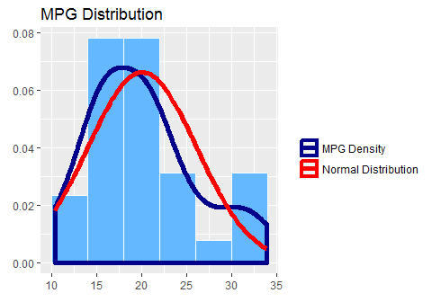
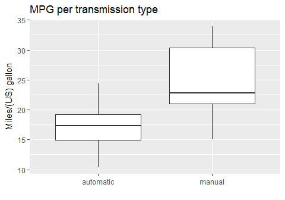

# Exploring relationship between transmission type and fuel consumption in mtcars dataset
Vadim K.  
2017-02-06  


##Executive summary
In this research we study the data of Motor Trend, a magazine about the automobile industry. The dataset is originated from 1974 and comprises fuel consumption and 10 aspects of automobile design and performance for 32 automobiles (1973–74 models).

We particularly focused on following two questions:  
- "Is an automatic or manual transmission better for MPG"  
- "Quantify the MPG difference between automatic and manual transmissions"  

To answer these questions we first did some exploratory analysis of the data, followed by hypothesis testing and fitting linear regressions. The conclusion we arrived to is that manual transmission is statistically significantly better for MPG than automatic one, the difference is 2.08 increase in MPG.

##Loading and processing data 
First we load the necessary packages and the data

```r
require(datasets); require(ggplot2); require(GGally); data(mtcars)
```

Checking the names of variables:

```r
names(mtcars)
```

```
##  [1] "mpg"  "cyl"  "disp" "hp"   "drat" "wt"   "qsec" "vs"   "am"   "gear"
## [11] "carb"
```

We transform variable `am` to a factor to be better treated by our models

```r
mtcars$am <- factor(mtcars$am, labels = c("automatic", "manual"))
```

##Exploratory analysis

First we plot the distribution of MPG in order to make sure it's approximately normal (see Figure 1 in Appendix).  
The general difference in MPG between automatic and manual transmission is observed on the corresponding box and whiskers plot (see Figure 2 in Appendix)

###Hypothesis test
We test the hypotesis that the mean MPG are different between two types of transmission

```r
t.test(mtcars[mtcars$am == "manual", "mpg"], mtcars[mtcars$am == "automatic", "mpg"])
```

```
## 
## 	Welch Two Sample t-test
## 
## data:  mtcars[mtcars$am == "manual", "mpg"] and mtcars[mtcars$am == "automatic", "mpg"]
## t = 3.7671, df = 18.332, p-value = 0.001374
## alternative hypothesis: true difference in means is not equal to 0
## 95 percent confidence interval:
##   3.209684 11.280194
## sample estimates:
## mean of x mean of y 
##  24.39231  17.14737
```
_p-value is <0.05 and confidence interval doesn't contain zero which means that the difference in means is statistically significant._


\pagebreak

## Appendix

####_Figure 1_
<!-- -->

####_Figure 2_
<!-- -->


