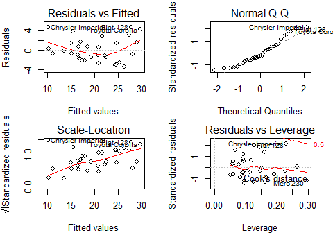

# Exploring relationship between transmission type and fuel consumption in mtcars dataset
Vadim K.  
2017-02-06  


##Executive summary
In this research we study the data of Motor Trend, a magazine about the automobile industry. The dataset is originated from 1974 and comprises fuel consumption and 10 aspects of automobile design and performance for 32 automobiles (1973–74 models).

We particularly focused on following two questions:  
- "Is an automatic or manual transmission better for MPG"  
- "Quantify the MPG difference between automatic and manual transmissions"  

To answer these questions we first did some exploratory analysis of the data, followed by hypothesis testing and fitting linear regressions. The conclusion we arrived to is that manual transmission is statistically significantly better for MPG than automatic one, the difference is 2.08 increase in MPG.

##Loading and processing data 
First we load the necessary packages and the data

```r
require(datasets); require(ggplot2); require(GGally); data(mtcars)
```

Checking the names of variables:

```r
names(mtcars)
```

```
##  [1] "mpg"  "cyl"  "disp" "hp"   "drat" "wt"   "qsec" "vs"   "am"   "gear"
## [11] "carb"
```

We transform variable `am` to a factor to be better treated by our models

```r
mtcars$am <- factor(mtcars$am, labels = c("automatic", "manual"))
```

##Exploratory analysis

First we plot the distribution of MPG in order to make sure it's approximately normal (see Figure 1 in Appendix).  
The general difference in MPG between automatic and manual transmission is observed on the corresponding box and whiskers plot (see Figure 2 in Appendix)

###Hypothesis test and inference
We test the hypotesis that the mean MPG are different between two types of transmission

```r
t.test(mtcars[mtcars$am == "manual", "mpg"], mtcars[mtcars$am == "automatic", "mpg"])
```

```
## 
## 	Welch Two Sample t-test
## 
## data:  mtcars[mtcars$am == "manual", "mpg"] and mtcars[mtcars$am == "automatic", "mpg"]
## t = 3.7671, df = 18.332, p-value = 0.001374
## alternative hypothesis: true difference in means is not equal to 0
## 95 percent confidence interval:
##   3.209684 11.280194
## sample estimates:
## mean of x mean of y 
##  24.39231  17.14737
```
_p-value is <0.05 and confidence interval doesn't contain zero which means that the difference in means is statistically significant._

##Model selection and diagnostic
We first fit a linear model between the `mpg` and our variable of interest `am`

```r
fit1 <- lm(mpg ~ am, data = mtcars); summary(fit1)$coef; summary(fit1)$adj.r.squared
```

```
##              Estimate Std. Error   t value     Pr(>|t|)
## (Intercept) 17.147368   1.124603 15.247492 1.133983e-15
## ammanual     7.244939   1.764422  4.106127 2.850207e-04
```

```
## [1] 0.3384589
```
_p-value of 'ammanual' coefficient is very low (0.00028) and the coefficient itself is equal 7.245 - that means according to our model there is a 7.245 MPG increase betweem automatic and manual transmission. In the meantime adjusted R-squared is only 0.3385 meaning our model explains only 33.85% of variation_  
In order to find a better model we'll take a look at pairwise plots and correlations between variables (see Figure 3 in Appendix).  
we can see that there is a correlation between MPG and following variables:
wt, hp, disp, cyl. So we will fit several multivariable linear regressions and compare then using `anova` function.

```r
fit2 <- lm(mpg ~ am + wt, mtcars); fit3 <- lm(mpg ~ am + wt + hp, mtcars);
fit4 <- lm(mpg ~ am + wt + hp + disp, mtcars); fit5 <- lm(mpg ~ am + wt + hp + disp + cyl, mtcars);
anova(fit1, fit2, fit3, fit4, fit5)
```

```
## Analysis of Variance Table
## 
## Model 1: mpg ~ am
## Model 2: mpg ~ am + wt
## Model 3: mpg ~ am + wt + hp
## Model 4: mpg ~ am + wt + hp + disp
## Model 5: mpg ~ am + wt + hp + disp + cyl
##   Res.Df    RSS Df Sum of Sq       F    Pr(>F)    
## 1     30 720.90                                   
## 2     29 278.32  1    442.58 70.5432 7.017e-09 ***
## 3     28 180.29  1     98.03 15.6250 0.0005286 ***
## 4     27 179.91  1      0.38  0.0611 0.8066730    
## 5     26 163.12  1     16.79  2.6758 0.1139322    
## ---
## Signif. codes:  0 '***' 0.001 '**' 0.01 '*' 0.05 '.' 0.1 ' ' 1
```
_According to p-value from anova we choose Model 3 -  adding more variables gives p-value >0.05_  
After checking adjusted R-squared of Model 3

```r
summary(fit3)$adj.r.squared
```

```
## [1] 0.8227357
```
We discover that it explains 82.27% of variation. Good but probably not the best possible.  
Another attempt we do with `step` function which runs a stepwise algorithm to choose a model according Akaike information criterion (AIC).

```r
fit6 <- step(lm(mpg ~ ., data = mtcars), trace = FALSE); fit6$call; summary(fit6)$adj.r.squared
```

```
## lm(formula = mpg ~ wt + qsec + am, data = mtcars)
```

```
## [1] 0.8335561
```
As R-squard of this model is higher and equal 0.8335 and we choose this model to proceed.  

For the chosen model we built the diagnostic plots (see Figure 4 in Appendix) and took a look particularly at residuals plot - no visual pattern has been detected, which speaks for model reliability.  
So the summary of final model is

```r
summary(fit6)
```

```
## 
## Call:
## lm(formula = mpg ~ wt + qsec + am, data = mtcars)
## 
## Residuals:
##     Min      1Q  Median      3Q     Max 
## -3.4811 -1.5555 -0.7257  1.4110  4.6610 
## 
## Coefficients:
##             Estimate Std. Error t value Pr(>|t|)    
## (Intercept)   9.6178     6.9596   1.382 0.177915    
## wt           -3.9165     0.7112  -5.507 6.95e-06 ***
## qsec          1.2259     0.2887   4.247 0.000216 ***
## ammanual      2.9358     1.4109   2.081 0.046716 *  
## ---
## Signif. codes:  0 '***' 0.001 '**' 0.01 '*' 0.05 '.' 0.1 ' ' 1
## 
## Residual standard error: 2.459 on 28 degrees of freedom
## Multiple R-squared:  0.8497,	Adjusted R-squared:  0.8336 
## F-statistic: 52.75 on 3 and 28 DF,  p-value: 1.21e-11
```
##Conslusion
Thus 


\pagebreak

## Appendix

####_Figure 1_
<!-- -->

####_Figure 2_
<!-- -->

####_Figure 3_
<!-- -->

####_Figure 4_



